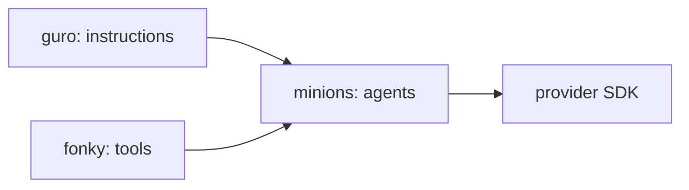

###### minions


___

minions is a lightweight Python framework for creating reusable AI agents across OpenAI,
Google Gemini, xAI Grok, and Anthropic Claude. It provides a small provider-specific implementation for each supported agent SDK.


minions places a consistent application-facing layer over those differences. Applications can
configure a named agent, assign instructions and tools, execute it synchronously or
asynchronously, and request streamed output without moving provider-specific logic into the
application itself.

## Project Structure

The repository root is also the lowercase `minions` Python package. There is no additional
`Minions/minions` directory and no separate `minion.py` or `minions.py` module.

```text
minions/
├── __init__.py          # Minion base class and public package exports
├── gpt.py               # OpenAI Agents SDK implementation
├── gemini.py            # Google Agent Development Kit implementation
├── grok.py              # Native xAI SDK implementation
├── claude.py            # Anthropic implementation
├── models.py            # Supported provider model identifiers
├── tests/
├── README.md
├── requirements.txt
└── pyproject.toml
```


## Installation

Create and activate a virtual environment, then install the package from its repository root:

```powershell
python -m venv .venv
.\.venv\Scripts\Activate.ps1
python -m pip install --upgrade pip
python -m pip install -e .
```

The provider SDKs can also be installed explicitly:

```powershell
python -m pip install openai-agents google-adk xai-sdk anthropic
```

Configure the credential required by the provider you intend to use:

```text
OPENAI_API_KEY=...
GOOGLE_API_KEY=...
XAI_API_KEY=...
ANTHROPIC_API_KEY=...
```

Do not commit API keys to source control.

## Quick Start

The following example combines a Guro instruction, Fonky tools, and an OpenAI Minion:

```python
from fonky.gpt import tools
from guro.instructions import DATA_SCIENTIST
from minions.gpt import GptMinion


minion = GptMinion(
    name='DataMinion',
    model='gpt-5-mini',
    instructions=DATA_SCIENTIST,
    tools=[
        tools.web_search_tool( ),
    ],
    description='Researches and analyzes data-supported questions.',
    max_turns=10,
)

result = minion.run( 'Analyze the available evidence and summarize the findings.' )
```

minions does not require fonky or guro. Equivalent values may be supplied directly, provided
the supplied tool is compatible with the selected provider:

```python
from agents import function_tool
from minions.gpt import GptMinion


@function_tool
def current_status( ) -> str:
    return 'Ready'


minion = GptMinion(
    name='ResearchMinion',
    model='gpt-5-mini',
    instructions='Research the question carefully and identify material uncertainty.',
    tools=[ current_status ],
)
```

## Base Minion Contract

The `Minion` base class is defined directly in `minions/__init__.py` and owns the state shared
by every provider implementation.

### Configuration

| Member | Type | Purpose |
|---|---|---|
| `name` | `str` | Human-readable agent name |
| `model` | `str` | Provider model identifier |
| `instructions` | `str` | System-level instructions supplied to the agent |
| `tools` | `list[Any]` | Provider-compatible hosted or function tools |
| `description` | `str` | Optional description of the agent's role |
| `max_turns` | `int` | Maximum model/tool iterations for one run |
| `context` | `dict[str, Any]` | Provider-neutral runtime context |
| `provider` | `Any` | Provider SDK agent, client, or runtime object |
| `result` | `Any` | Most recent provider-native result |

### Operations

| Method | Purpose |
|---|---|
| `create()` | Creates the provider-specific agent or runtime |
| `run(prompt)` | Executes the agent synchronously |
| `run_async(prompt)` | Executes the agent asynchronously |
| `stream(prompt)` | Starts provider-supported streamed execution |
| `add_tool(tool)` | Adds a tool when it is not already registered |
| `remove_tool(tool)` | Removes a registered tool |
| `set_context(key, value)` | Stores a runtime context value |
| `get_context(key)` | Retrieves a runtime context value |
| `clear_context()` | Clears runtime context |
| `reset()` | Clears transient execution state while retaining configuration |
| `to_dict()` | Returns a provider-neutral configuration dictionary |

Provider methods return provider-native results. minions does not currently conceal response
differences behind a normalized result model.

## Provider Examples

### OpenAI

```python
from fonky.gpt import tools
from minions.gpt import GptMinion


minion = GptMinion(
    name='OpenAIResearcher',
    model='gpt-5-mini',
    instructions='Research the request and provide a concise, sourced response.',
    tools=[ tools.web_search_tool( ) ],
)

result = minion.run( 'What changed in the source material?' )
```

### Gemini

```python
from fonky.gemini import tools
from minions.gemini import GeminiMinion


minion = GeminiMinion(
    name='GeminiResearcher',
    model='gemini-2.5-flash',
    instructions='Research the request and explain the result clearly.',
    tools=[ tools.web_search_tool( ) ],
)

result = minion.run( 'Summarize the relevant evidence.' )
```

### Grok

```python
from fonky.grok import tools
from minions.grok import GrokMinion


minion = GrokMinion(
    name='GrokResearcher',
    model='grok-4.6',
    instructions='Investigate the request and distinguish facts from inference.',
    tools=[ tools.web_search_tool( ) ],
)

result = minion.run( 'Identify the latest material developments.' )
```

### Claude

```python
from fonky.claude import tools
from minions.claude import ClaudeMinion


minion = ClaudeMinion(
    name='ClaudeResearcher',
    model='claude-sonnet-4-6',
    instructions='Analyze the request carefully and explain material limitations.',
    tools=[ tools.web_search_tool( ) ],
)

result = minion.run( 'Review the available information and summarize the result.' )
```

## Tool Ownership

minions consumes tools but does not define fonky's provider integrations.

| Capability | Fonky module |
|---|---|
| OpenAI tools | `fonky.gpt.tools` |
| Gemini tools | `fonky.gemini.tools` |
| Grok tools | `fonky.grok.tools` |
| Claude tools | `fonky.claude.tools` |

Provider-native capabilities are not artificially forced into identical implementations:

| Provider | Web search | File/retrieval search | Computer use | Code execution |
|---|---:|---:|---:|---:|
| OpenAI | Yes | File Search | Yes | Code Interpreter |
| Gemini | Google Search | Vertex AI Search | Yes | Built-in code executor |
| Grok | Yes | Collections Search | No native equivalent exposed | Yes |
| Claude | Yes | No equivalent exposed initially | Yes | Yes |

## Instruction Ownership

guro instruction values are plain strings. minions accepts them without importing or copying
guro's instruction files:

```python
from guro import instructions
from fonky.claude import tools
from minions.claude import ClaudeMinion


minion = ClaudeMinion(
    name='BudgetMinion',
    model='claude-sonnet-4-6',
    instructions=instructions.get( 'BUDGET_ANALYST' ),
    tools=[ tools.web_search_tool( ) ],
)
```

This preserves the package boundaries:



## Model Identifiers

Provider model identifiers are exported from `minions.models`:

```python
from minions.models import CLAUDE_MODELS
from minions.models import GEMINI_MODELS
from minions.models import GPT_MODELS
from minions.models import GROK_MODELS
```

These collections are intended for validation, configuration interfaces, and model selectors.
Applications should still confirm model availability for their provider account and region.

## Design Boundaries

minions deliberately avoids embedding provider-specific features in the base class. Handoffs,
subagents, hosted searches, computer environments, code sandboxes, and provider session services
remain the responsibility of the relevant implementation.

The base class standardizes only the concepts genuinely shared by the providers:

- Identity and description
- Model selection
- Instructions
- Tool registration
- Runtime context
- Synchronous execution
- Asynchronous execution
- Streaming
- Transient-state reset

This keeps the public interface reusable without pretending the underlying providers are
identical.

## Development

Run the tests from the parent directory containing the lowercase `minions` repository:

```powershell
python -m pytest minions\tests
```

Tests should mock provider network operations. Unit tests must not require live API calls or
consume provider credits.

## Related Projects

- [fonky](https://github.com/is-leeroy-jenkins/fonky#fonky) — provider-compatible AI tools
- [guro](https://github.com/is-leeroy-jenkins/guro#guro) — reusable instruction library
- [OpenAI Agents SDK](https://openai.github.io/openai-agents-python/)
- [Google Agent Development Kit](https://google.github.io/adk-docs/)
- [xAI API Tools](https://docs.x.ai/developers/tools/overview)
- [Anthropic Python SDK](https://platform.claude.com/docs/en/api/sdks/python)
- [Claude Agent SDK](https://code.claude.com/docs/en/agent-sdk/overview)
