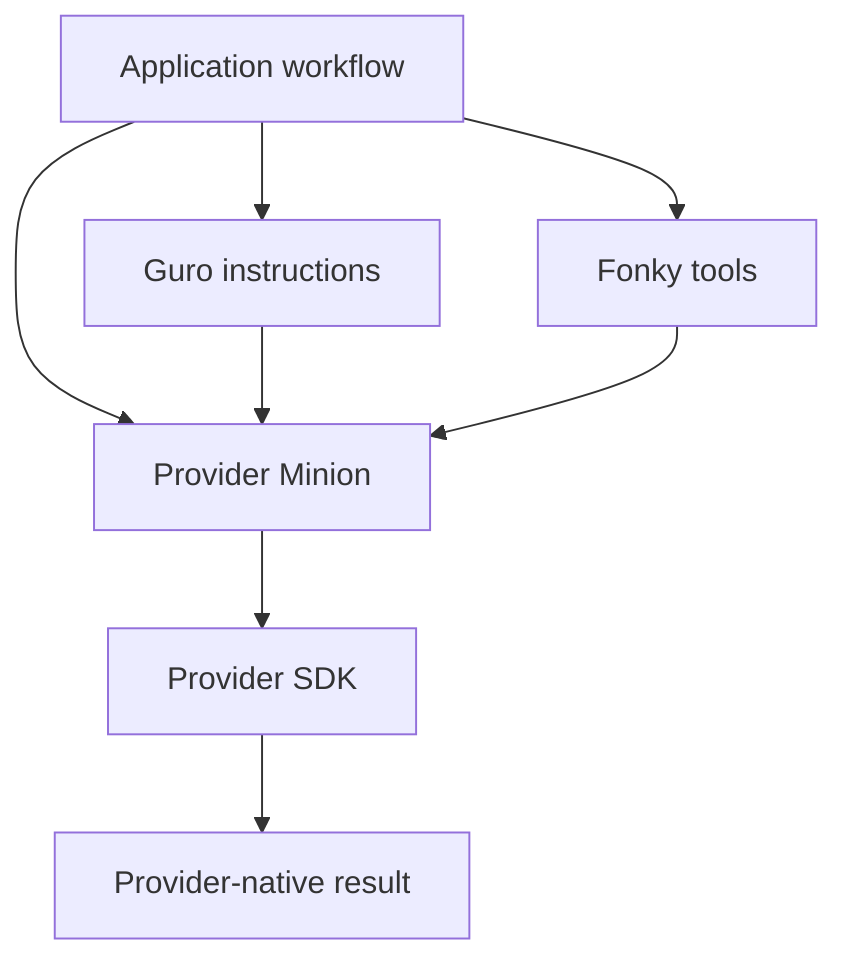
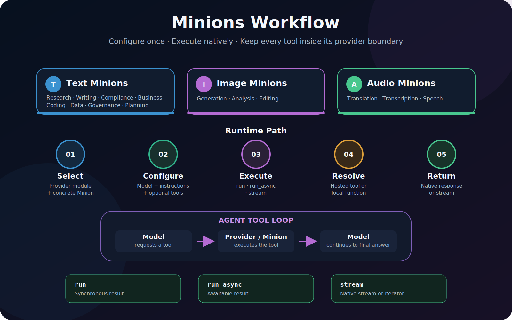

# Architecture

Minions is deliberately provider-oriented. A workflow selects exactly one provider module and
uses models, tools, messages, and results from that same provider.

{ .minions-diagram }

## Package boundary



Guro and Fonky are optional companions. Minions does not import either package, so callers may
provide instruction text and tools from their own application.

## Provider module responsibilities

Each module owns five responsibilities:

1. Accept provider-native configuration and tools.
2. Validate arguments before contacting the provider.
3. Create the provider agent, runner, or chat.
4. Execute local tool calls when the SDK does not do so automatically.
5. Return provider-native results without a lossy common wrapper.

OpenAI and Gemini offer provider `Agent` base classes, so their `Minion` classes inherit those
types directly. Grok, Claude, and Mistral expose different runtime abstractions; their Minions
compose the corresponding clients and runners instead of inventing incompatible multiple
inheritance.

## Workflow lifecycle

{ .minions-diagram }

For local function tools, Grok and Mistral require an exact match between every function-tool
schema and its callable. Provider-hosted tools do not require local functions. OpenAI, Gemini,
and Claude delegate their supported tool lifecycle to their native SDK runners.

## Concrete class model

Concrete classes are intentionally thin templates:

```python
from minions.gpt import ComplianceMinion


class BudgetMinion( ComplianceMinion ):
    """OpenAI Minion specialized for federal budget compliance."""

    minion_name: str = 'Budget Minion'
```

They identify workflow purpose and supply a default display name. Behavior remains configurable
through ordinary construction and inheritance; no factory or registry is required.
