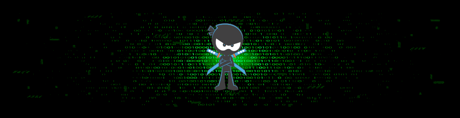
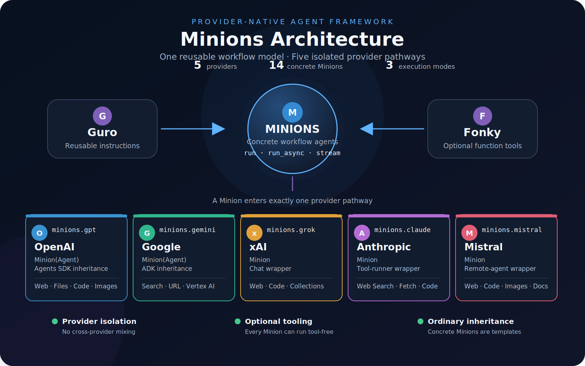

{ .minions-hero }

# Provider-native agents for reusable workflows

Minions provides one consistent workflow-agent family across OpenAI, Google Gemini, xAI Grok,
Anthropic Claude, and Mistral. Each provider module accepts its own native models, tools, return
types, and streaming interface—without translating provider contracts or forcing tools into
workflows that do not need them.

[Get started](user-guide/getting-started.md){ .md-button .md-button--primary }
[Browse the API](api/index.md){ .md-button }

---

## Where Minions fits

| Package | Responsibility |
| --- | --- |
| [Guro](https://github.com/is-leeroy-jenkins/guro) | Reusable system instructions organized by workflow category |
| [Fonky](https://github.com/is-leeroy-jenkins/fonky) | Reusable provider-compatible functions and tool schemas |
| **Minions** | Provider agents, native tools, tool execution, async execution, and streaming |

## Provider pathways

| Module | Provider SDK | Implementation | Native execution |
| --- | --- | --- | --- |
| `minions.gpt` | OpenAI Agents SDK | Inherits `agents.Agent` | `run`, `run_async`, `stream` |
| `minions.gemini` | Google ADK | Inherits `google.adk.Agent` | `run`, `run_async`, `stream` |
| `minions.grok` | xAI SDK | Owns sync and async chats | `run`, `run_async`, `stream` |
| `minions.claude` | Anthropic SDK | Owns native tool runners | `run`, `run_async`, `stream` |
| `minions.mistral` | Mistral SDK | Owns a remote agent | `run`, `run_async`, `stream` |

## Workflow templates

Every provider exposes the same fourteen concrete workflow roles:

`ResearchMinion`, `WritingMinion`, `ComplianceMinion`, `BusinessMinion`, `CodingMinion`,
`DataMinion`, `GovernanceMinion`, `PlanningMinion`, `ImageGenerationMinion`,
`ImageAnalysisMinion`, `ImageEditingMinion`, `TranslationMinion`, `TranscriptionMinion`, and
`SpeechMinion`.

The class communicates intent. The `instructions`, `model`, and optional `tools` determine the
actual behavior.

## Design guarantees

- **Provider fidelity** — tools and response objects stay native to the selected SDK.
- **Optional tools** — tool-free workflows remain first-class.
- **Complete tool loops** — local calls continue until the provider returns a final response.
- **Explicit limits** — `max_turns` guards every workflow against an unbounded loop.
- **Typed public surface** — provider-specific result and tool types remain visible.

{ .minions-diagram }

[Explore the architecture](architecture.md){ .md-button }
